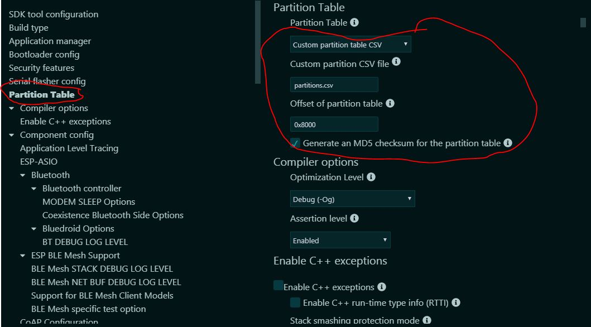
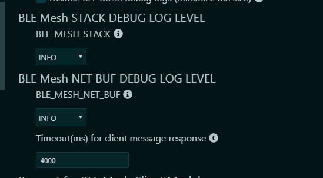
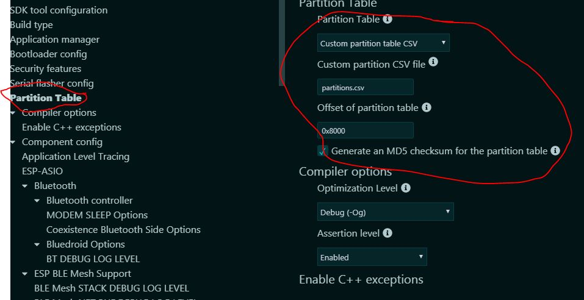
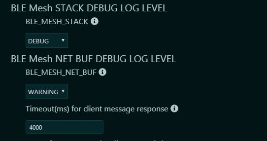
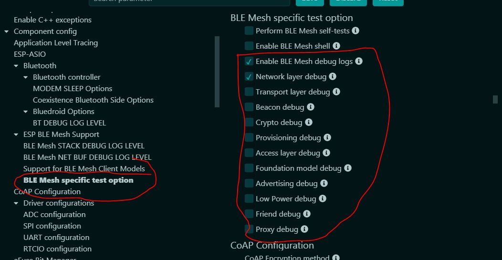
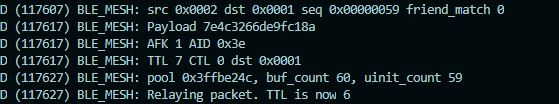

# On_off_model_with_relay
Hello, this code is to show the simple on off model with relay functionality, just to clear the air about the relay node functioning.
This will consists of three things, client, server and relay.

<b>#Server:-</b>

Upload the on_off_sever code to one of the esp32 board with led at pin number 22. You can modify the pin number according to your choice. Just correct the pin number  in the code. for uploading the code into the esp32 just ensure that uses the same menuconfig setting as I mentioned. Please ensure that.

Upload the code and run it.

<b>#Relay:-</b>
 Upload the relay code into another esp32. with the configurations (check below)
 
 
 
 
 After uploading the code. monitor the logs in the terminal.

<b>#Client:-</b>
This will be your android phone, loaded with the nrf mesh application. nrf mesh will be used to provision the server and the node. The provisionor will have the unicast address of 0x0001. This will also be the address of the on_off_client model.First provision the server model and check the funcionality by tapping of the on/off button. The detailed version to how to provision the node and check the on/off functionality plesase visit https://docs.espressif.com/projects/esp-idf/en/latest/esp32/api-guides/esp-ble-mesh/ble-mesh-index.html#getting-started-with-ble-mesh. After that add the relay node.
Also after provisioned all the devices the screen will look like below. 

Now tap on the connect button and connect to the realy node only.(be specific on this. connect only to the relay node.)

After all the above setup, send the on/off signal from the nrf mesh app to the server. after taping the on button, you will observer the following lines in the console.
 

You will observer that, a packet has been received by the relay node by the souce unicast address of 0x0001 and to the server unicast address of 0x0002. After receiveing the packet, a packet has been sucessfully relayed.  Also check the acknowlegemet packet has been send by the server to the client which is also be seen in the below screeen shot. 
 
